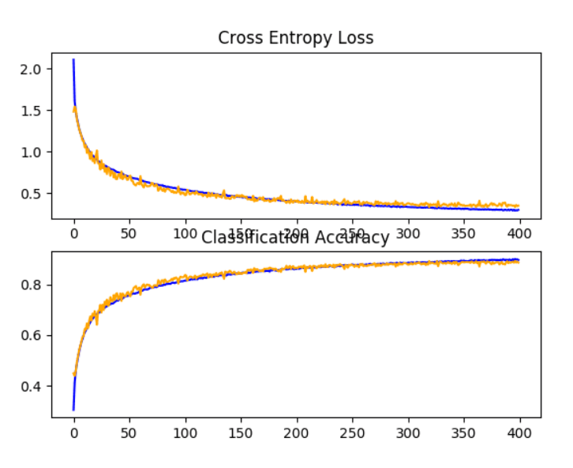

# CIFAR-10 photo classification

Develop a CNN from scratch for CIFAR-10 photo classification.

<p align="center">
    
</p>

The CIFAR-10 small photo classification problem is a standard dataset used in computer vision and deep learning.

CIFAR is an acronym that stands for the Canadian Institute For Advanced Research and the CIFAR-10 dataset was developed along with the CIFAR-100 dataset by researchers at the CIFAR institute.

The dataset is comprised of 60,000 32×32 pixel color photographs of objects from 10 classes, such as frogs, birds, cats, ships, etc.

## Loading dataset
The example below loads the CIFAR-10 dataset using the Keras API:
```python
from keras.datasets import cifar10

(trainX, trainY), (testX, testY) = cifar10.load_data()
```

```shell
Train: X=(50000, 32, 32, 3), y=(50000, 1)
Test: X=(10000, 32, 32, 3), y=(10000, 1)
```

## Input
We know that the pixel values for each image in the dataset are unsigned integers in the range between no color and full color, or 0 and 255.

We do not know the best way to scale the pixel values for modeling, but we know that some scaling will be required.

A good starting point is to normalize the pixel values, e.g. rescale them to the range [0,1]. This involves first converting the data type from unsigned integers to floats, then dividing the pixel values by the maximum value.

## Model
Creating a model for our neural network:
```python
from keras.models import Sequential

# define cnn model
def define_model():
	model = Sequential()
	# ...
	return model
```

## Evaluate
After the model is defined, we need to fit and evaluate it.

Fitting the model will require that the number of training epochs and batch size to be specified. We will use a generic 100 training epochs for now and a modest batch size of 64.

It is better to use a separate validation dataset, e.g. by splitting the train dataset into train and validation sets. We will not split the data in this case, and instead use the test dataset as a validation dataset to keep the example simple.

The test dataset can be used like a validation dataset and evaluated at the end of each training epoch. This will result in a trace of model evaluation scores on the train and test dataset each epoch that can be plotted later.
```python
# fit model
history = model.fit(trainX, trainY, epochs=100, batch_size=64, validation_data=(testX, testY), verbose=0)

_, acc = model.evaluate(testX, testY, verbose=0)
```

This test harness can evaluate any CNN models we may wish to evaluate on the CIFAR-10 dataset and can run on the CPU or GPU.

## Results
we can see that we achieved a further lift in model performance to about 88% accuracy, improving upon both dropout and data augmentation alone at about 84% and upon the increasing dropout alone at about 85%.
```
> 88.620
```

